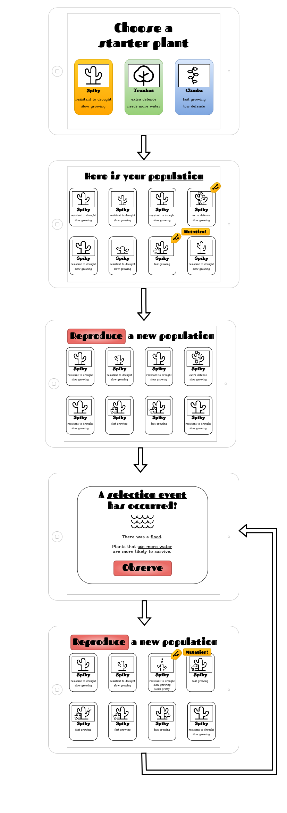
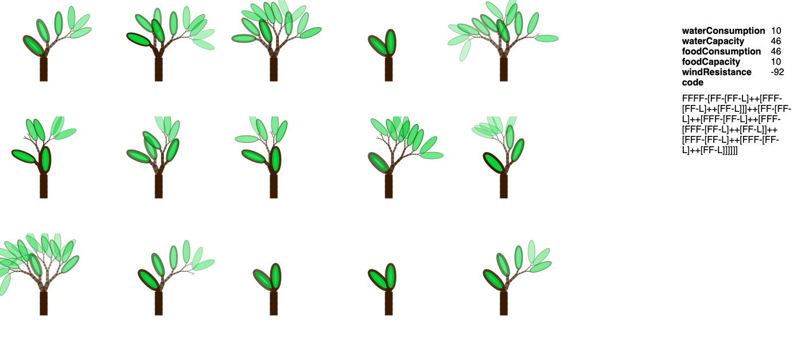

# BranchNu

A simulation about mutating and naturally selecting plants.

## Brief

> Our latest unit, on evolution, will be a flagship for our burgeoning USA market. Not only is it a key point of curriculum coverage that we’re lacking, it’s one that’s considered both controversial and critical to scientific literacy. Therefore, it’s important to our mission to impart a clear and deep understanding of the scientific concepts involved.

> You’ve been hired to participate in a competition to design and create a working prototype of one such simulation for our evolution unit. It must demonstrate the concepts of random variation and natural selection central to evolution.

## Core simulation loop

1. Start with a **single ancestor** plant with a set of attributes
2. Create a population of plants with **random mutations**
3. Create a new population of plants through **reproduction**
4. Have a chance for a **natural selection event** to occur that select for certain attributes
5. _Go to 3._



## Questions for students

- How did the plant's initial form look compared to its final form?

  - It first looked similar to it's initial form but then changed as it adapted to environmental events
  - This could be shown via tree diagrams of the evolution of their plants after they've "completed" the simulation
  - This knowledge could be demonstrated through a sequencing activity of a sample of the plants and events they saw through the simulation

- Do the plants choose to evolve mutations that helped them survive?

  - No! The kind of mutations that happen random! Yet the population adapts to the selection pressure of its environment
  - This could be reinforce by showing charts of the distribution of adaptions over time, which would demonstrate that not all mutations make sense for the environment, but the ones that do, stick around

- What is the difference between an adaptive vs non-adaptive mutation?
  - If it helps the plant survive future selection events it's adaptive
  - This knowledge could be demonstrated by giving students a categorization activity to choose adaptive vs non-adaptive traits of their plants in a specific selection event

## The prototype

The [prototype](src/index.html) is very simple. Despite the buttons at the bottom of the page, it's not interactive. It just creates a random population of plants. Steps 1. and 2. in the core simulation loop. You can refresh the page to see a new population.

### One key moment

The wireframes above imply very simple attributes and hint at slightly more complex visualisation of those attributes.

However, when I first conceived of BranchNu, I was thinking much more about more complex simulation of plant variations. The advantage of this approach is to allow for extenstions of the kind of mutations that can happen beyond the imagination of the creator of the simulation and to allow for the complexity to show mutations are neither inherently good or bad.



Each of the plants is generated using the same [Lindenmayer-system](https://en.wikipedia.org/wiki/L-system) but different L-codes. For the biology teachers, think genotype and phenotype respectively. For the software engineers, think class and object respectively (or prototype and object for the JS programmers).

This base could allow the future iterations of the protype to explore lot of kinds of mutations and cross-breeding to the plants' "genomes".

## Next steps

For this prototype I would want to add in some examples of variations in starter plants (Step 1.) and simple versions of the "mutation" (step 3.) and "selection" step (step 4.). This would help us understand how engaging the core loop of the simulation is.

### Starter plants

To create new start plants we would to need to add more rules. e.g., to make needles for a cactus (see line 38 in [src/plant.js](src/plant.js)):

```javascript
const lsystem = new LSystem({
        ...
        finals: {
            ....
            "<": {
              // Make the leaves thinner
              leafWidth -= 5
            }
```

And then add them into the initial system (see line 96 in [src/plant.js](src/plant.js)):

```javascript
// Init and iterate the L-System
lsystem.setAxiom("<<<<FFFF-[X]++[X]");
```

### Mutation

Mutation could be done in many ways but the simplest and most extensible would be to put rules in the initial L-system string (as seen in the starter plants example above).

Thus an individual mutation would just be a string modification a.k.a, a regex. For example, making leaves absorb more sun would be removing the needle rule ("<") in the example above, i.e., `s/<//g`.

A list of mutations could each be given a descriptive name and put into a list to be randomly selected from for each new generation of plants.

### Selection

This would be a matter of removing some of the plants from the population based on their attributes. Creating a list of these events with a description and a function that describes these conditions and then randomly selecting one and then applying it to the existing population of plants would be trivial.

### Other mechanics

There are a few interesting mechanics that could make this a more engaging activity in a classroom with more depth or cross-curricular applications that would be interesting to explore:

- Add more traits and L-system rules

  - e.g., the ability to control the shape and colour of leaves or the hardness of branches

- Simplify the attributes and selection events using LLMs

  - It would be nice to keep the underlying flexibility and complexity of the prototype system while hiding that complexity for students who don't have time to understand everything
  - Using an LLM to turn a set of attributes into a name that doesn't imply if an adaptation is good or bad (e.g., thin+long+hard leafs -> spiky)
  - Use the LLM to create summaries and conditions for how likely a plant is to survive an event

- Allow students to create their own selection events and mutations

  - This would give students more examples and feel more invested in the simulation and also allow teachers to explore specific ecosystems as part of other learning goals

- Have a system for uploading images for the starter plants. Use AI to segment the plants and generate variations

  - In addition to getting students to practice Art and IT skills, it would allow teacher to explore plant biology in an offline activity which would then translate into an online activity in a natural and engaging way

- Add multiple species of plants and animals to show adaptation to predator/prey dynamics
  - Explores some selection pressures in a bit more detail and shows that nature applies selection pressures to itself in a complex and dynamic way

### Polish

There's lots of room for making the art more fun, improving the layout and adding in animations and sounds to keep students engaged. If you were to rebuild the prototype for a production version, choosing a framework that makes these tasks easy would be a priority since everything else in the prototype is plain JS and can be easily adapted.

## Other questions

- How did you come up with this idea?

  - See the [planning document](PLANNING.md).

- Why plants (and not animals)?

  - The brief talks about how in the US evolution is "controversial". Many creationists (the source of the "controversy") focus on animal biology your less likely to find students are innoculated against the idea of learning about plant evolution!
  - Plants can be created using code with lots of variety using L-systems. Cool!
  - Plants can be pretty and can get student demographics not typically interested in "the mechanics" of biology engaged

- Why the trading card theme?
  - Kids like trading cards (at least according to my childhood and according to my 5/15/18 year old nieces)
  - I play a lot of deck building roguelike games. I have come to realise they demonstrate random mutation (card decks are randomly modified) and natural selection (your deck is bad, you lose) very obviously if played many times (you "reproduce" deck by playing similar startegies in subsequent rounds)!
